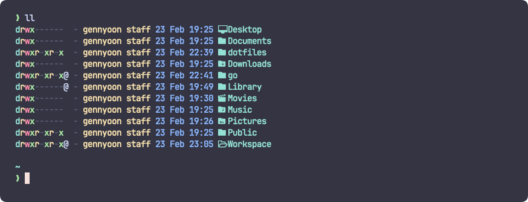

<div align="center">
  <h3>GennYoon's Dotfiles</h3>
</div>



#### Install

Just run:

```bash
git clone https://github.com/gennyoon/dotfiles.git ~/dotfiles
cd ~/dotfiles
source install.sh
```

Set your git credentials

```bash
git config --global user.name = "your name"
git config --global user.email = "your@email.com"
git config --global github.user "your-github-username"
```

#### Terminal

- Kitty 0.32.2
- Neovim >= 0.9.0 (needs to be built with LuaJIT)
- Git >= 2.19.0 (for partial clones support)
- OhMyZsh
- Starship
-

#### Tmux

#### Nvim

- [LazyGit](https://github.com/kdheepak/lazygit.nvim?tab=readme-ov-file)
- [Neotree](https://github.com/nvim-neo-tree/neo-tree.nvim?tab=readme-ov-file)
- [Todo Comments](https://github.com/folke/todo-comments.nvim?tab=readme-ov-file)
-
